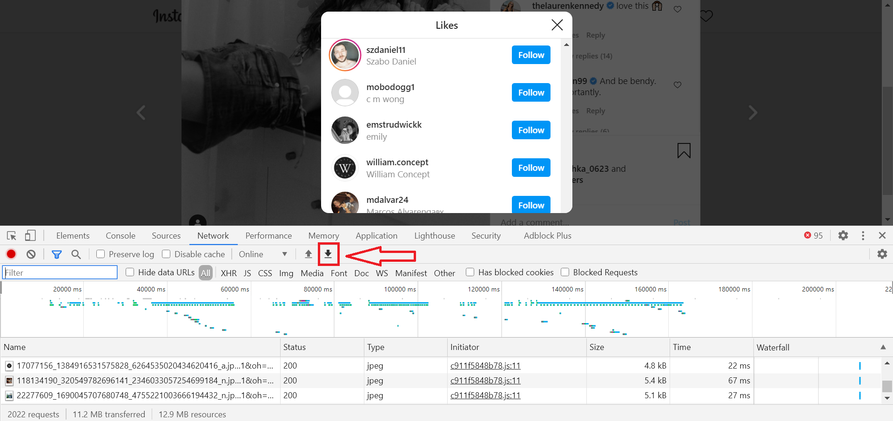

# Instagram Engagement Metrics

A personal project for "scraping" Instagram engagement data

### Use Case

With the rise of influencer marketing on Instagram, engagement metrics became an increasingly valuable statistic for burgeoning influencers when trying to appeal to brands. While a high number of followers is important, what is arguably more important is the fraction of your followers who actually see and engage with your content. Those who do not are called "ghost followers" - accounts that follow you, but don't engage with your posts (through likes or comments). 

Although ghost followers are commonly associated with "bot" accounts, this term also includes users who have "muted" your content, a feature that blocks your posts or stories from showing up on their feeds. So while they are contributing to the number of accounts who follow you, they will not engage with your content through likes, comments, etc, thus lowering your engagement score. [This article](https://blog.kicksta.co/ghost-followers-on-instagram/) explains in more detail why a low engagement store is toxic for Instagram users hoping to attract brands to work with. 

Instagram's API does not provide information on which accounts have muted you. However, you can find those who are likely to have muted you by looking at which accounts have (not) liked your posts. This strategy would weed out both the accounts who have muted you and bot accounts. 

Unfortunately, the Instagram API does not provide information on which specific accounts have liked or commented on your posts, so it is impossible to compare a follower list to a list of "likers" solely using the Instagram API. 

### Code Solution

Although the Instagram API does not provide this information, individual users are able to manually view the list of people who have liked a certain post, both in the Instagram app and the Instagram website. 

I tried a variety of methods for pulling this list, from highlighting and copying/pasting it to web scrapers. However, the elements of the list are loaded and unloaded dynamically as a user scrolls, so that the only account information present in the code is of those accounts that are currently visible in the modal. This eliminated the possibility of highlighting and copying the list or using a traditional web scraper. 

### Data Collection

For each post I wanted to gather data about, I clicked on the post, opened Developer Tools, open the list of likers, and scroll all the way to the bottom of the list, with develop tools open. Scrolling to the bottom created network requests that included all of the likers for the post. I could then export the .har file of the network requests straight from the Network tab. 

Collecting data on the list of accounts one follows was easier, likely because this is information available through the API, so the "safeguard" against web crawlers was not in place. I was able to highlight and copy/paste the list from the modal and make the resulting text a simple .txt file. 

### Data Parsing

The .har file could then be treated like a .json file and parsed to pull out the account names. I've included the parsing file I wrote in Python [here](https://github.com/anjulismith13/instagram-unfollow/blob/master/har-parser.py). 
The copy/pasted follower list was much easier to parse than the network requests. Those two lists could then be compared for overlap, with accounts followed by the user that haven't liked any of the user's posts being added to an unfollow.txt file.

I also included functionality for a "passlist" of accounts that a user wants to keep following, regardless of their engagement with your posts. Each account bound for the unfollow list is compared against the passlist before being added. 

### Data Analysis

As most users wouldn't want to automatically unfollow every account that doesn't engage with your posts (you may want to add it to your passlist), I did not think it wise to automate unfollowing accounts that were generated by the analysis. However, for most users, there end up being hundreds of accounts in the unfollow list, and it becomes tedious to look up every account on the list manually through the Instagram app. Thus, I automated opening each account in the unfollow list in a new tab so users could readily view each account's information in one tab and quickly make their decision whether to unfollow them there. 

The first time I tried this, Instagram (understandably) temporarily blocked me, because my program tried to open hundreds of Instagram tabs in the same millisecond. Now, tabs are opened at a random interval between 0 and 3 seconds, which doesn't eliminate, but reduces the chance of Instagram viewing the actions as those of a bot. 

### Example

I've included sample data (of following lists, passlist, post .har files) for a celebrity's public account (@jenniferaniston). The passlist is composed of a random half of her following list. 

--create a sample data folder--
